<h3>MSc Computer Science Graduate</h3>

 

 

## About Me

Hi! I'm Soniya, an M.Sc. Computer Science graduate with a strong interest in technology and problem-solving.

I enjoy learning by building, experimenting with new ideas, and exploring Python, Machine Learning, AI, and Web Development. I'm continuously improving my technical and problem-solving skills as I begin my career in IT.

🌱 Always learning 
💻 Building & experimenting 
🎯 Growing as a software professional 
🤝 Open to learning and connecting 

 

## 💼 Experience

**Python, Machine Learning & Deep Learning Intern** — *CodeLab Systems, Mangalore*
`March 2026 – July 2026`
- Completed an intensive 4-month internship covering Python, ML, NLP, and Deep Learning methodologies
- Developed and trained ML/DL models applying CNNs and supervised learning techniques
- Executed end-to-end data pipelines: preprocessing, feature engineering, model training, and evaluation

 

## 🚀 Featured Projects

<table>
<tr>
<td width="50%" valign="top">

### 🛣️ Pothole Detection & Traffic Analysis

YOLOv8-based real-time pothole detection and traffic risk analysis system integrated into a Flask web app with MySQL backend. Includes traffic risk scoring (Low/Medium/High) and alternate route suggestions for road safety.

`Python` `YOLOv8` `OpenCV` `Flask` `MySQL`

[View Repo →](https://github.com/soniya-dev02/Pothole-Detection-and-Traffic-Analysis)

</td>
<td width="50%" valign="top">

### 👁️ Eye Disease Prediction

CNN-based deep learning model to classify retinal eye diseases from medical images, with automated preprocessing using OpenCV.

`TensorFlow` `Keras` `OpenCV`

[View Repo →](https://github.com/soniya-dev02/Eye-Disease-Prediction)

</td>
</tr>

<tr>
<td width="50%" valign="top">

### 🚗 Car Price Prediction

ML regression model predicting used car prices from vehicle specifications, deployed via a Flask REST API.

`Python` `Pandas` `NumPy` `Scikit-learn` `Flask`

[View Repo →](https://github.com/soniya-dev02/Car-Price-Prediction)

</td>

<td width="50%" valign="top">

### ✨ More Projects Ahead

New projects and ideas will be added soon.

[See all repos →](https://github.com/soniya-dev02?tab=repositories)

</td>
</tr>
</table>

 

## 🛠️ Tech Stack

 

## 📊 GitHub Stats

 

 

## 📈 GitHub Activity

 

## 🏆 GitHub Trophies

 

## 🎓 Education 

**M.Sc. Computer Science** — Mangalore University *(2024 – 2026)* 
**B.Sc. Computer Science** — Mangalore University, Koteshwara *(2020 – 2023)*

 

*Thanks for visiting my profile! I'm always open to learning, collaborating, and connecting on software development and machine learning projects.*

